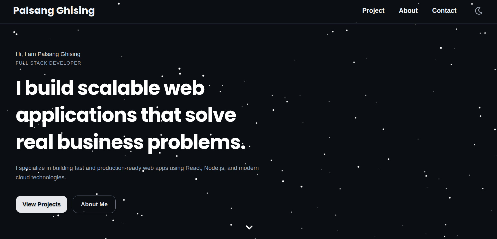
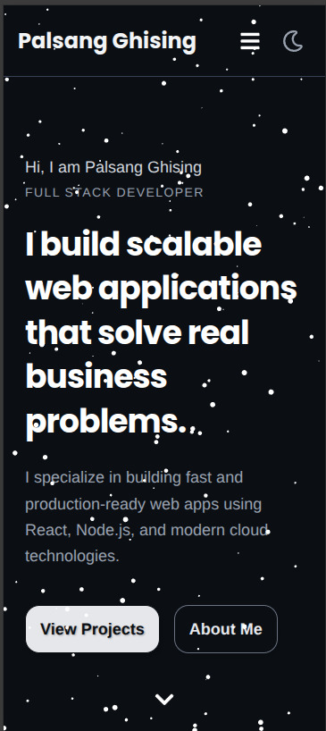
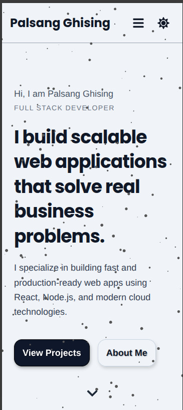
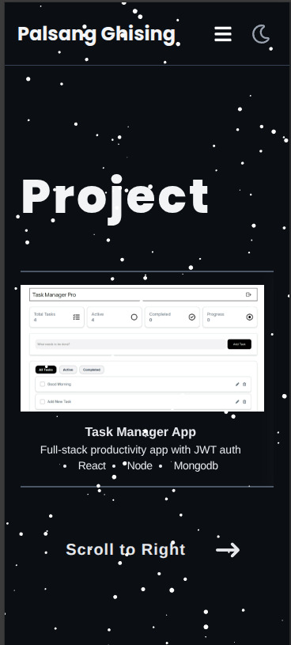

# Portfolio Website

This is my personal developer portfolio, showcasing my projects, skills, and experience.

## Live Demo
my-portfolio-lac-zeta-63.vercel.app

## Features
- Responsive design (desktop & mobile)
- Dark/Light mode toggle
- Project cards with live demo
- Smooth hover animations
- Contact form

## Tech Stack
- React
- Typescript
- Tailwind CSS
- Framer Motion 
- Vercel

## Screenshots






## Installation
Clone the repository and install dependencies:

```bash
git clone https://github.com/Ghising-Palsang/My-Portfolio.git
cd portfolio
npm install
npm run dev